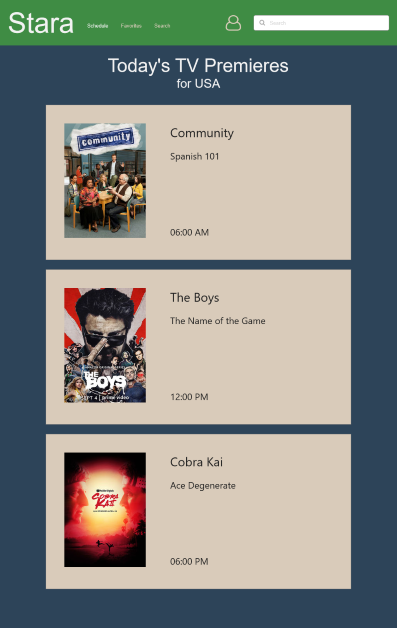
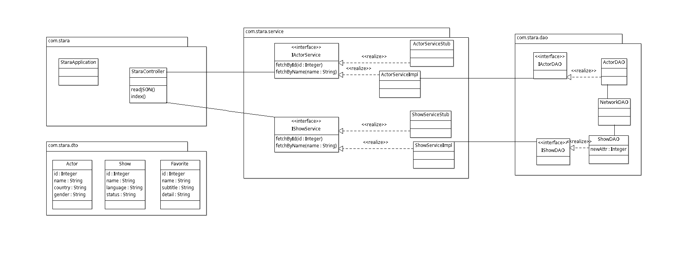

# IT4045C-Stara
---

## Introduction  

Have you ever wondered what to watch next?
Due to the popularity of streaming services today, there are just too many options.  

Stara can help you by:
- Keeping a list of shows and actors you are interested in
- Showing you what episodes are premiering in your country
- Letting you quickly search for shows based on their title or cast

Users can interact with Stara using either a set of RESTful service endpoints, or a simple UI, or both.  
In addition, Android users can interact with Stara on the go with a native application.

## Storyboard  
[Stara Storyboard](https://rwhf87.axshare.com) Password: Stara 
- Storyboard Interaction:  
  - Pages are scrollable
  - Pseudo-autocomplete search functionality
  - Pseudo-login functionality
  - List items are clickable, opening a new tab to TVMaze

## Requirements  

### Requirement 101.0: Search for Shows  
As a user interested in TV Shows, I want to be able to search for TV Shows based on Title or Cast.

**Examples**  
**1.1**  
**Given** a feed of TV Show data is available.  
**When** the user/service searches for “Joel” with filter “Actor” applied  
**Then** the user/service should see actors with “Joel” in their name  

**1.2**   
**Given** a feed of TV Show data is available.  
**When** the user/service searches for “Community” with filter “Show” applied.  
**Then** the user/service should see TV Shows with “Community” in their title.  

**1.3**  
**Given** a feed of TV Show Data is available  
**When** the user/service searches for “kajsdluaopuidfjoajsd”  
**Then** the user/service should not receive any results.  

### Requirement 102.0: Manage List of Favorites
As a user interested in TV Shows, I want to be able to maintain a list of my favorite TV shows and actors that I can quickly share.

**Examples**  
**2.1**  
**Given** the user/service is authenticated and thus logged in.  
**When** the user/service searches for “Community” with the filter “Show” applied.  
**When** the user/service marks “Community” as a favorite.  
**Then** when the user/service views their list of Favorites, they should see “Community”.  

**2.2**  
**Given** the user/service is authenticated and thus logged in.  
**When** the user/service requests a report of their favorites.  
**Then** the user/service will be returned a detailed report of their favorite shows and actors.  

**2.3**
**Given** the user/service is authenticated and thus logged in.  
**When** the user/service views their favorites and requests to share.  
**Then** the user/service will be able to quickly share the favorite in question.  

### Requirements 103.0: Premiering Episodes
As a user interested in TV Shows, I want to be able to quickly see what TV shows for my country of residence have episodes premiering today.

**Examples**  
**3.1**  
**Given** A feed of TV show data is available, and the user has granted location access  
**When** the user opens the homepage  
**Then** the user should see a list of TV shows for their country of residence that have episodes premiering today.  

**3.2**  
**Given** A feed of TV show data is available, but the user has denied location access  
**When** the user opens the homepage  
**Then** the user should see a list of TV shows for the USA that have episodes premiering today.  

## Class Diagram  
  

### Class Diagram Description  

- **StaraApplication**: Spring Boot Application as a whole.  
- **StaraController**: Spring Boot Controller responds to endpoints.  
- **Actor**: Noun class that represents a TV Actor.  
- **Show**: Noun class that represents a TV Show.  
- **Favorite**: Noun class that represents a favorite Show or Actor.  
- **IActorService**: Interface for Actor Service that is used to get Actor data.  
- **ActorServiceStub**: Stub that provides dummy data for Actor Service interface.  
- **ActorServiceImpl**: Implementation of IActorService.  
- **IShowService**: Interface for Show Service that is used to get Show data.  
- **ShowServiceStub**: Stub that provides dummy data for Show Service interface.  
- **ShowServiceImpl**: Implementation of IShowService.  
- **IActorDAO**: Interface to find and parse Actor JSON.  
- **ActorDAO**: Implementation of IActorDAO.  
- **NetworkDAO**: Provides low-level network information used to communicate with an online data store.  
- **IShowDAO**: Interface to find and parse Show JSON.  
- **ShowDAO**: Implementation of IShowDAO.  

## JSON Schema
This is what we plan to export to another app.

    {
      "type" : "object",
      "properties" : {
        "detail" : {
          "type" : "string"
        },
        "id" : {
          "type" : "integer"
        },
        "name" : {
          "type" : "string"
        },
        "subtitle" : {
          "type" : "string"
        }
      }
    }

## Team Members and Roles
- Product Owner/Scrum Master/DevOps/GitHub Administrator: Umer Muhammad
- Business Logic and Persistence Specialist: Parneet Kang and Umer Muhammad
- Marketing Specialist: Kris Furterer and Umer Muhammad
- UI Specialist: Aida Musaeva and Umer Muhammad

## Milestones
- Milestone 0: Planning
- Milestone 1: Define Service Endpoints, Basic UI, Write Unit Tests
- Milestone 2: Persistence and Implement Interfaces
- Milestone 3: Integrate
 
## Weekly Stand Up Meeting
Via WhatsApp on Sundays at 8 PM
